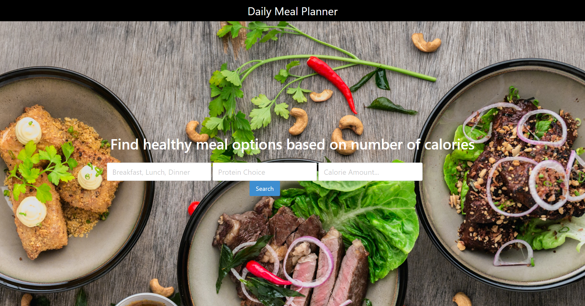

# Daily-Meal-Planner

## Description
For this project my group wanted to create a web app that lets users find meals for anytime of the day. Daily meal planner allows you to select the meal of the day, the protien you want and how many calories you want to intake. Once you find your desired meal you can go to the map page and put in your zipcode or address and find the closest grocery stores. This app takes a lot of the stress of away from not knowing what meal to make. I learned a lot about server apis and how to work in a group. 

## Table of Contents (Optional)

- [Installation](#installation)
- [Usage](#usage)
- [Credits](#credits)
- [License](#license)

## Installation

Go to the github and open the deployed page and make your way through the pages.

## Usage

https://owenforeman1.github.io/daily-meal-planner/

## Credits

https://github.com/dev-dominick

https://github.com/Mikefedele

https://github.com/kgiunta

https://github.com/owenforeman1

https://bulma.io/

https://www.edamam.com/

https://developer.mapquest.com/documentation/search-api/v2/

https://developer.mapquest.com/documentation/static-map-api/v5/

## License
MIT License

Copyright (c) [2022] [Owen Foreman]

Permission is hereby granted, free of charge, to any person obtaining a copy
of this software and associated documentation files (the "Software"), to deal
in the Software without restriction, including without limitation the rights
to use, copy, modify, merge, publish, distribute, sublicense, and/or sell
copies of the Software, and to permit persons to whom the Software is
furnished to do so, subject to the following conditions:

The above copyright notice and this permission notice shall be included in all
copies or substantial portions of the Software.

THE SOFTWARE IS PROVIDED "AS IS", WITHOUT WARRANTY OF ANY KIND, EXPRESS OR
IMPLIED, INCLUDING BUT NOT LIMITED TO THE WARRANTIES OF MERCHANTABILITY,
FITNESS FOR A PARTICULAR PURPOSE AND NONINFRINGEMENT. IN NO EVENT SHALL THE
AUTHORS OR COPYRIGHT HOLDERS BE LIABLE FOR ANY CLAIM, DAMAGES OR OTHER
LIABILITY, WHETHER IN AN ACTION OF CONTRACT, TORT OR OTHERWISE, ARISING FROM,
OUT OF OR IN CONNECTION WITH THE SOFTWARE OR THE USE OR OTHER DEALINGS IN THE
SOFTWARE.

## Features

-Recipe finder

-Grocery finder and directions

## How to Contribute

owenhtforeman@gmail.com
